# 详解HTTP

### TCP三次握手

1. 客户端向服务端发送报文；这个阶段：服务端：接收能力（✓）发送能力（待确认） 客户端：接收能力（待确认）发送能力（待确认）**客户端的发送能力需要服务端返回报文确认，本身无法确认发送能力是否正常，比如可能发送失败**
2. 服务端返回报文；这个阶段：服务端：服务端：接收能力（✓）发送能力（待确认） 客户端：接收能力（✓）发送能力（✓）
3. 客户端最后发送确认收到报文给服务端；这个阶段：服务端：服务端：接收能力（✓）发送能力（✓） 客户端：接收能力（✓）发送能力（✓）
4. 开始数据传输，如下图

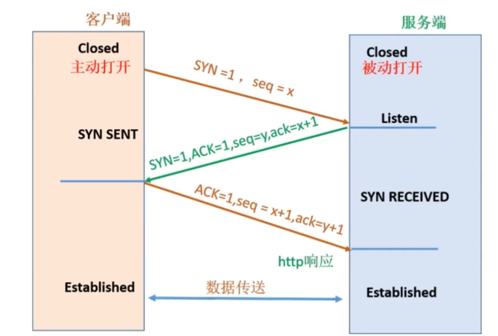

### DNS服务器

> DNS服务器是本地访问互联网上内容，在不知道具体的IP地址的情况下使用到的服务器

1. 浏览器输入网站域名，点击回车
2. 系统检索本地host文件，查看是否有对应的IP地址，如果有直接跳转到第四步
3. 系统首先向本地DNS服务器（就是配置的首选DNS服务器和备用DNS服务器）发送域名，获取到返回的IP地址，如果没有，就继续向上传递域名，直到根服务器，如果还没有对应的IP就返回错误页面，反之就返回对应的IP地址
4. 获取到域名对应的IP地址，向浏览器发送请求，浏览器返回对应的网页内容，如下图

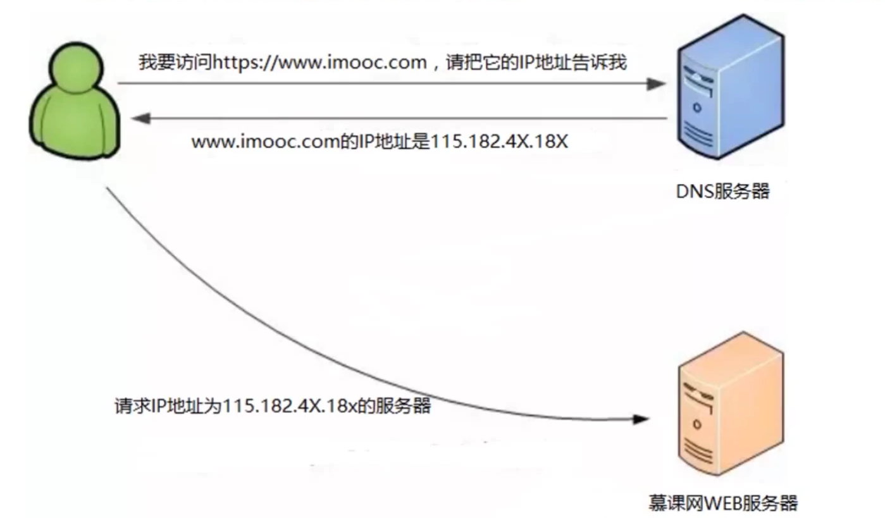

### HTTP协议特点

* 支持 客户端/服务端 模式

  必须由 客户端首先发起连接，最后由服务端返回内容断开连接

+ 简单快速

  HTTP协议简单，通信迅速

+ 灵活

  可以传输任意对象

+ 无状态

  不会保存之前的状态状态信息，即如果请求需要之前的处理信息就要重新传递；

+ 无连接

  每次连接只会处理一次请求，每次请求都要重新连接。**（keepalive保持通道通信）**

### URI，URL，URN

URI（Uniform Resource Identifier）：统一资源标识符

URL（Uniform Resource Location）：统一资源定位器

URN（Uniform Resource Name）：统一资源名称

### HTTP请求/相应报文结构

> 请求报文结构

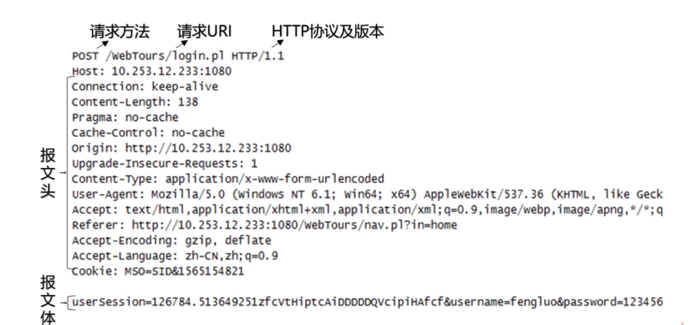

> 响应报文结构

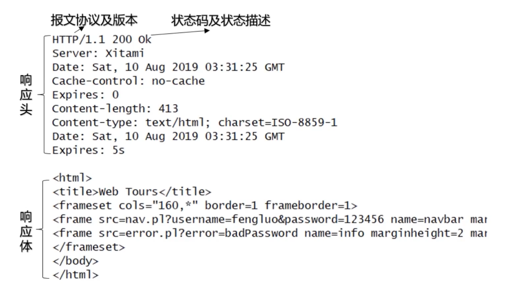

### HTTP请求方法

+ get（常用）

  如：www.baidu.com?username=123，请求的参数以键值对的形式随着URL发送到服务端

+ post（常用）

  发送的请求的参数会被放在请求体中；**（注：get和post方法同样会被抓包，post并不比get方法安全多少）**

+ put（不常用）

  从客户端向服务端发送的数据取代指定的文档的内容，如：换头像；与post类似，put幂等，post不幂等（幂等即进行多次操作，结果一样）

+ head（不常用）

  类似put，返回的响应没有具体内容，用于获取报头，结构如下：(options同)

  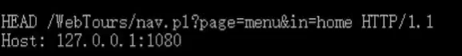

+ delete（不常用，有安全漏洞）

  请求服务端删除指定资源

+ options

  用来查询针对请求URI指定的资源支持的方法，如下图

  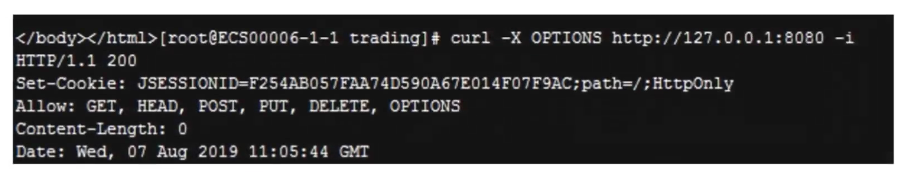

+ trace（不常用，有安全漏洞）

  回显服务期收到的请求，主要用于测试或诊断，容易引起跨站攻击

+ connect

  开启一个客户端与所请求资源之间的双向沟通的通道，它可以用来创建隧道，如：代理服务器

### 状态码

> HTTP状态码汇总

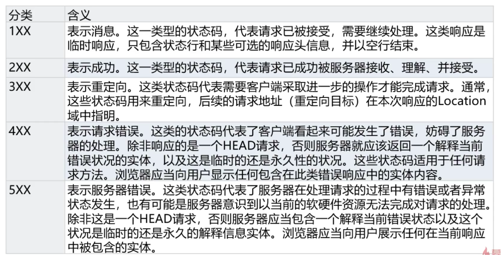

> HTTP2xx状态码

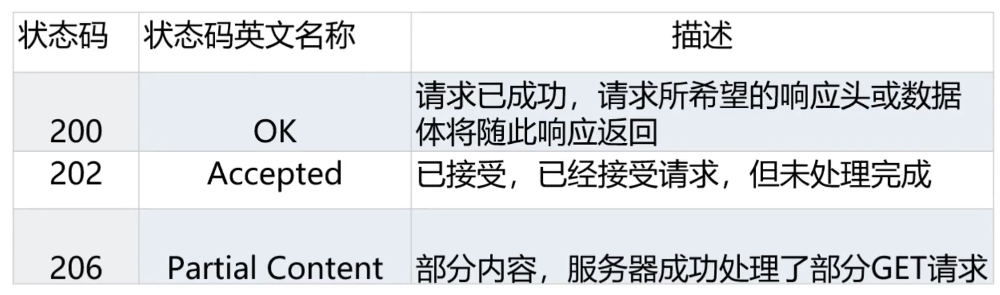

> HTTP3xx状态码

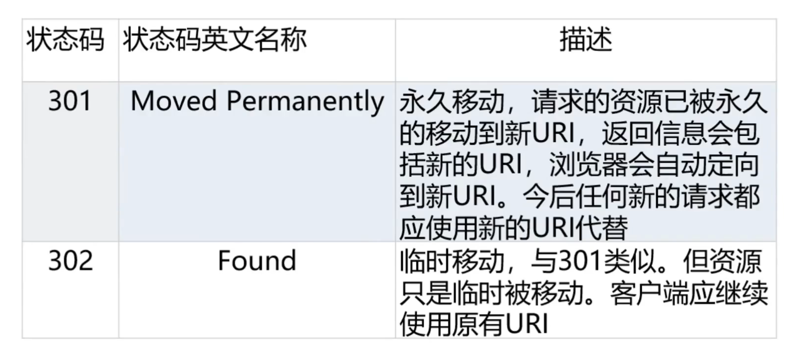

> HTTP4xx状态码

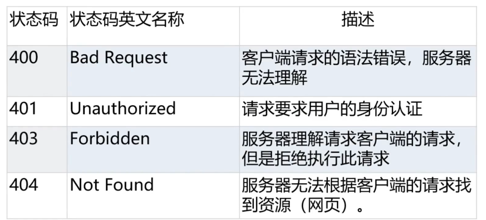

> HTTP5xx状态码

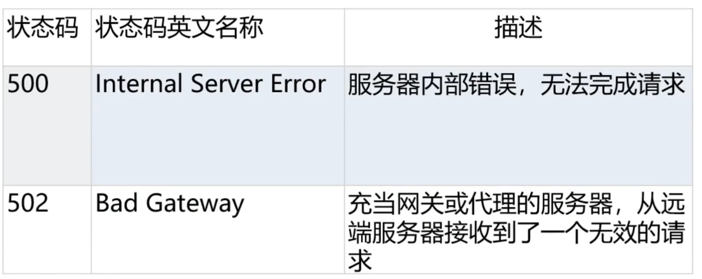

### Cookie，Session

cookie是客户端存储消息的一种机制

​	特点：

+ 存放在客户端
+ 可以自行设置过期时间
+ 对服务器造成的压力小
+ 对用户透明，即随时可看

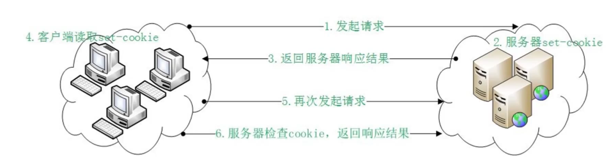

session是服务端存储消息的一种机制

特点：

+ 存放在服务端
+ 定时清理不活跃客户
+ 用户无法查看具体内容
+ 每一个客户都会生成一个对应的session

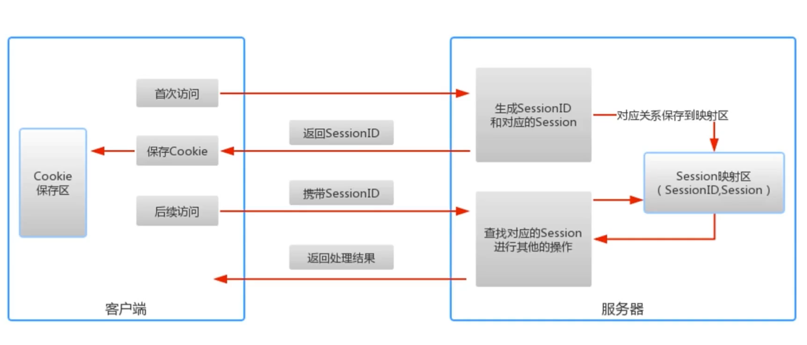

### HTTP身份认证

1. Basic认证（不常用，有安全漏洞）

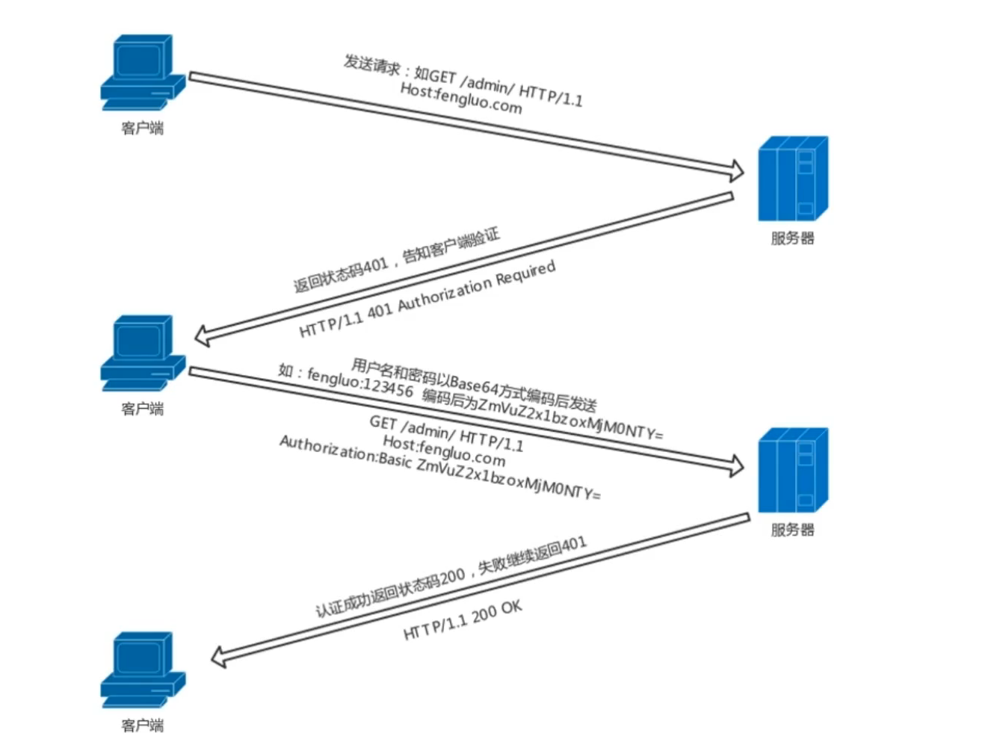

2. Digest认证（不常用，有安全漏洞）

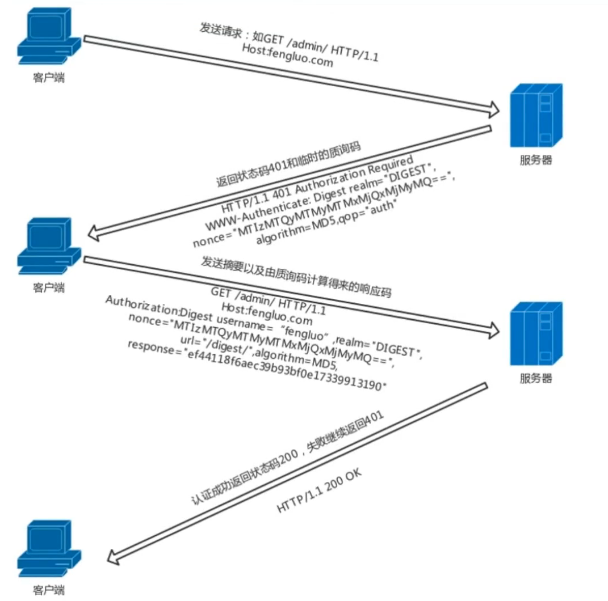

以上两种情况在账号密码被盗取之后无法验证是否本人操作，有一定的安全性问题

3. SSL客户端认证

   通过账号密码登录之后，服务端会下发一个证书，操作者每次向服务器发送请求都需要携带证书，成本较高

4. 基于表单验证

   由web程序各自实现基于表单的认证方式。通过Cookie和Seesion来保存用户的状态。基于表单的认证方式不是由HTTP协议定义的。

### HTTP的长连接与短连接

​	HTTP的长连接与端连接本质上是TCP的长连接和短连接

​	在需要请求多次的情况下，长连接会节省带宽和资源，在客户端增多的情况下，可以设置最多连接数，并且清理不活跃的长连接通道，以保证服务器的资源。

### HTTP代理

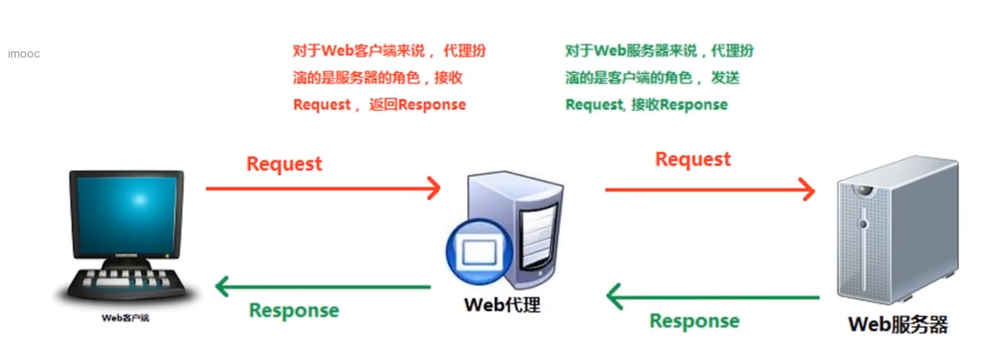

​	代理可以充当客户端/服务端，可以拦截返回内容，可以翻墙，可以抓包等等；

### HTTP网关

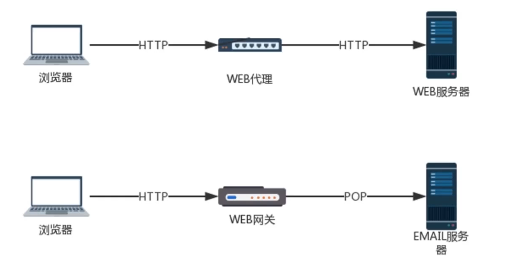

​	网关用来转换不同协议，web代理只能处理相同协议

### HTTP缓存

​	HTTP缓存是为了不去浪费时间请求没有改动过的文件资源，选择就近获取静态文件

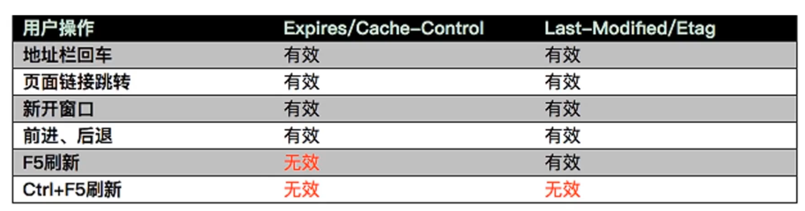

### HTTP内容协商机制

+ 客户端驱动

  由客户端选择当前语言，选择之后向服务器请求对应资源

+ 服务端驱动

  由服务端根据Accept-language来选择对应的资源

+ 代理

  由代理缓存，代替客户端选择对应的资源

### HTTP断点续传和多线程下载

​	根据HTTP Request：Range来主动或者被动的进行片段下载：

​	Range：bytes=0-499 从 0 开始下载到 499 字节

​	Range：bytes=500-999 从 500 字节开始 下载到 999 字节

​	Range：bytes=-500 下载最后 500字节

​	Range：bytes=500-  从 500 下载到 最后字节

​	Range：bytes=500-600,601-999 分别同时从 500 下载到 600 ，从 601 下载到 999

​	HTTP Response Content-Range：

​	用于响应头中，在发出带Range的请求后，服务器会在Content-Range 头部返回当前接受的范围和文件总大小。一般格式：Content-Range：bytes（unit first byte pos）- [last byte pos] / [entity length]，使用断点续传返回的状态码是206

### HTTPS

HTTPS和HTTP是两种不同的协议，HTTPS是由 HTTP + TLS （TLS协议的前身是 SSL协议）组合而成，TLS协议位于应用层和传输层之间。

通常使用数字证书来认证。

特点：

+ 安全性高
+ 消耗资源高
+ 对访问的速度有一定的影响